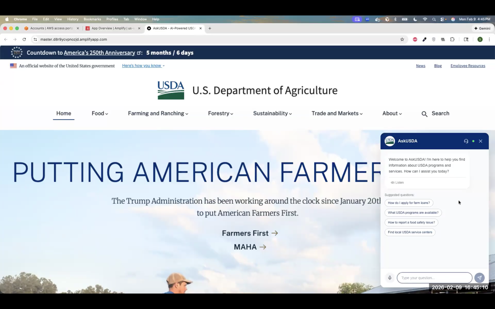
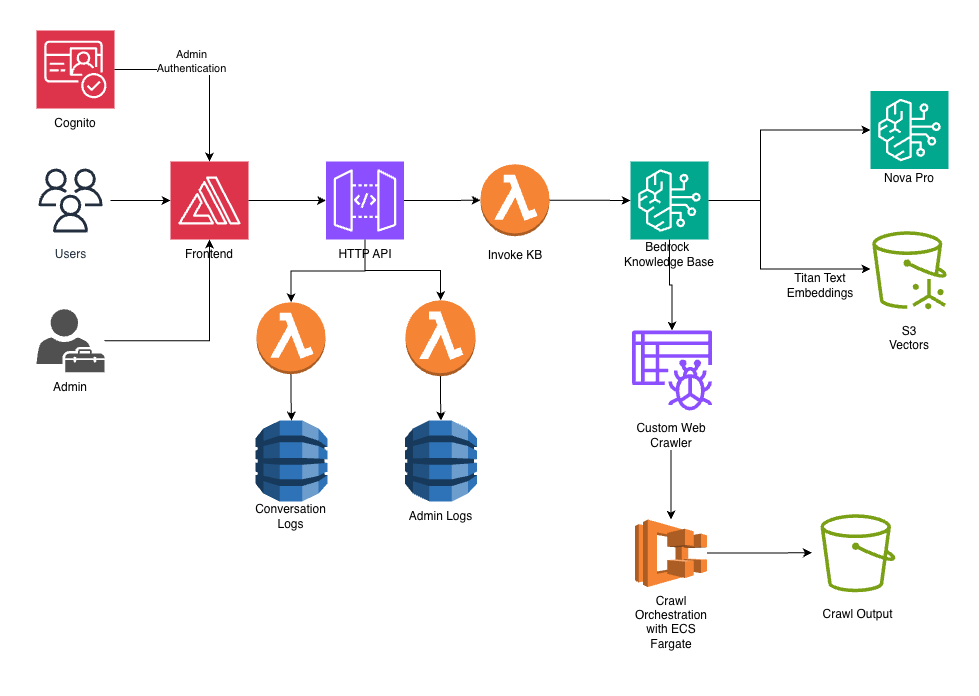

# AskUSDA - USDA Chatbot

AskUSDA is an intelligent AI-powered chatbot that helps the public, farmers, and ranchers quickly find accurate information from USDA programs and services. It uses AWS Bedrock Knowledge Bases, a serverless backend, and a modern Next.js frontend with a hover-over chatbot experience.

---

## Demo Video

Watch the complete demonstration of AskUSDA:

<div align="center">
  <a href="https://drive.google.com/file/d/1xnU1nZjxnDKQiq-Wtss3vza3UDiMUuM5/view?usp=sharing">
    
  </a>
  <p><em>Click the image above to watch the demo (opens in Google Drive)</em></p>
</div>

---

## Disclaimers

Customers are responsible for making their own independent assessment of the information in this document. This document:

(a) is for informational purposes only,

(b) references AWS product offerings and practices, which are subject to change without notice,

(c) does not create any commitments or assurances from AWS and its affiliates, suppliers or licensors. AWS products or services are provided "as is" without warranties, representations, or conditions of any kind, whether express or implied. The responsibilities and liabilities of AWS to its customers are controlled by AWS agreements, and this document is not part of, nor does it modify, any agreement between AWS and its customers, and

(d) is not to be considered a recommendation or viewpoint of AWS.

Additionally, you are solely responsible for testing, security and optimizing all code and assets on GitHub repo, and all such code and assets should be considered:

(a) as-is and without warranties or representations of any kind,

(b) not suitable for production environments, or on production or other critical data, and

(c) to include shortcuts in order to support rapid prototyping such as, but not limited to, relaxed authentication and authorization and a lack of strict adherence to security best practices.

All work produced is open source. More information can be found in the GitHub repo.

---

## Table of Contents

| Description           | Link                                                                 |
| --------------------- | -------------------------------------------------------------------- |
| Overview              | [Overview](#overview)                                                |
| Architecture          | [Architecture Diagram](#architecture-diagram)                        |
| Detailed Architecture | [Architecture Deep Dive](docs/architectureDeepDive.md)               |
| Deployment            | [Deployment Guide](#deployment-guide)                                |
| User Guide            | [User Guide](docs/userGuide.md)                                      |
| API Documentation     | [API Documentation](docs/APIDoc.md)                                  |
| Modification Guide    | [Modification Guide](docs/modificationGuide.md)                      |
| Credits               | [Credits](#credits)                                                  |
| License               | [License](#license)                                                  |

---

## Overview

AskUSDA is an AI-powered chatbot that helps the public, farmers, and ranchers quickly find accurate information from USDA programs and services. It enables natural-language conversations over USDA.gov content, with a hover-over chatbot on the main site and an admin dashboard for monitoring user feedback and escalations.

### Key Features

- **AI-Powered Conversations** using AWS Bedrock with Nova Pro
- **Knowledge Base Integration** with USDA.gov and farmers.gov content via S3 data source and S3 Vectors
- **Real-time Streaming Responses** over WebSockets for a natural chat experience
- **Citation Support** with source references for transparency
- **Thumbs Up/Down Feedback** stored per message for analytics
- **Admin Dashboard** for metrics, conversation feedback, and escalation requests
- **Escalation Requests** with view/delete and full conversation preview
- **Hover-over Chatbot** and responsive design for desktop and mobile

---

## Architecture Diagram



The application implements a serverless architecture on AWS, combining:

- **Frontend**: Next.js application hosted on AWS Amplify (main page with hover chatbot, `/admin` dashboard)
- **Backend**: AWS CDK–deployed WebSocket API + HTTP Admin API with Lambda handlers
- **AI Layer**: AWS Bedrock Knowledge Base and Nova Pro, with guardrails for filtering out harmful content and block denied topics
- **Data Storage**: DynamoDB for conversation logs, feedback, and escalation requests

For a detailed explanation of the architecture, see the [Architecture Deep Dive](docs/architectureDeepDive.md).

---

## Deployment Guide

For complete deployment instructions, see the [Deployment Guide](./docs/deploymentGuide.md).

---

## User Guide

For detailed usage instructions with screenshots, see the [User Guide](./docs/userGuide.md).

---

## API Documentation

For complete API reference, see the [API Documentation](./docs/APIDoc.md).

---

## Modification Guide

For developers looking to extend or modify this project, see the [Modification Guide](./docs/modificationGuide.md).

---

## Directories

```
├── backend/
│   ├── bin/
│   │   └── backend.ts             # CDK app entry point (deploys Crawler + Backend stacks)
│   ├── crawler/                   # Web crawler Docker image and configuration
│   │   ├── Dockerfile
│   │   ├── entrypoint.sh
│   │   ├── requirements.txt
│   │   ├── urls.yaml              # Seed URLs for crawling
│   │   └── worker/                # Python crawler code
│   ├── lambda/
│   │   ├── websocket-handler/
│   │   │   └── index.js           # WebSocket chat, feedback, escalation Lambda
│   │   ├── admin-api/
│   │   │   └── index.js           # Admin HTTP API Lambda (metrics, feedback, escalations)
│   │   └── kb-sync-handler/
│   │       └── index.js           # KB sync Lambda (triggers ECS crawler + Bedrock ingestion)
│   ├── lib/
│   │   ├── backend-stack.ts       # Main backend stack (KB, Lambdas, APIs, DynamoDB)
│   │   └── crawler-stack.ts       # Crawler infrastructure stack (ECS, VPC, S3)
│   ├── cdk.json
│   ├── package.json
│   └── tsconfig.json
├── frontend/
│   ├── app/
│   │   ├── layout.tsx
│   │   ├── page.tsx               # Main page with background and hover chatbot
│   │   ├── admin/page.tsx         # Admin login page
│   │   ├── dashboard/page.tsx     # Admin dashboard (metrics, feedback, escalations)
│   │   ├── components/ChatBot.tsx # Hover-over chatbot UI and WebSocket client
│   │   ├── context/
│   │   │   └── AdminAuthContext.tsx # Cognito auth state for admin
│   │   └── globals.css
│   ├── public/
│   │   ├── usda-bg.png            # USDA website background image
│   │   └── usda-symbol.svg        # USDA logo used in UI
│   └── package.json
├── docs/
│   ├── architectureDeepDive.md
│   ├── deploymentGuide.md
│   ├── userGuide.md
│   ├── APIDoc.md
│   ├── modificationGuide.md
│   └── media/
│       ├── architecture.png
│       └── user-interface.gif
├── buildspec.yml                  # CodeBuild build spec (backend deploy + frontend build + Amplify upload)
├── deploy.sh                      # One-command deployment script (IAM, Amplify, CodeBuild)
├── LICENSE
└── README.md
```

### Directory Explanations:

1. **backend/** - Contains all backend infrastructure and serverless functions
   - `bin/` - CDK app entry point (deploys both `AskUSDA-Crawler` and `AskUSDA-Backend` stacks)
   - `crawler/` - Web crawler Docker image, Python worker code, and seed URL configuration
   - `lambda/` - Lambda source: `websocket-handler` (chat, feedback, escalation), `admin-api` (metrics, feedback, escalations), and `kb-sync-handler` (crawler orchestration + KB ingestion)
   - `lib/` - CDK stack definitions (`crawler-stack.ts` for ECS/VPC, `backend-stack.ts` for KB/APIs/Lambdas)

2. **frontend/** - Next.js frontend application
   - `app/` - Next.js App Router pages and layouts
   - `public/` - Static assets

3. **docs/** - Project documentation
   - `media/` - Images, diagrams, and GIFs for documentation

---

## Credits

This application was developed by:

**Associate Cloud Developers:**

- <a href="https://www.linkedin.com/in/sreeram-sreedhar/" target="_blank">Sreeram Sreedhar</a>
- <a href="https://www.linkedin.com/in/shaashvatm156/" target="_blank">Shaashvat Mittal </a>

**UI/UX Designer:**
- <a href="https://www.linkedin.com/in/ashik-tharakan/" target="_blank">Ashik Mathew Tharakan</a>

Built in collaboration with the ASU Cloud Innovation Center.

---

## License

This project is licensed under the MIT License - see the [LICENSE](./LICENSE) file for details.

